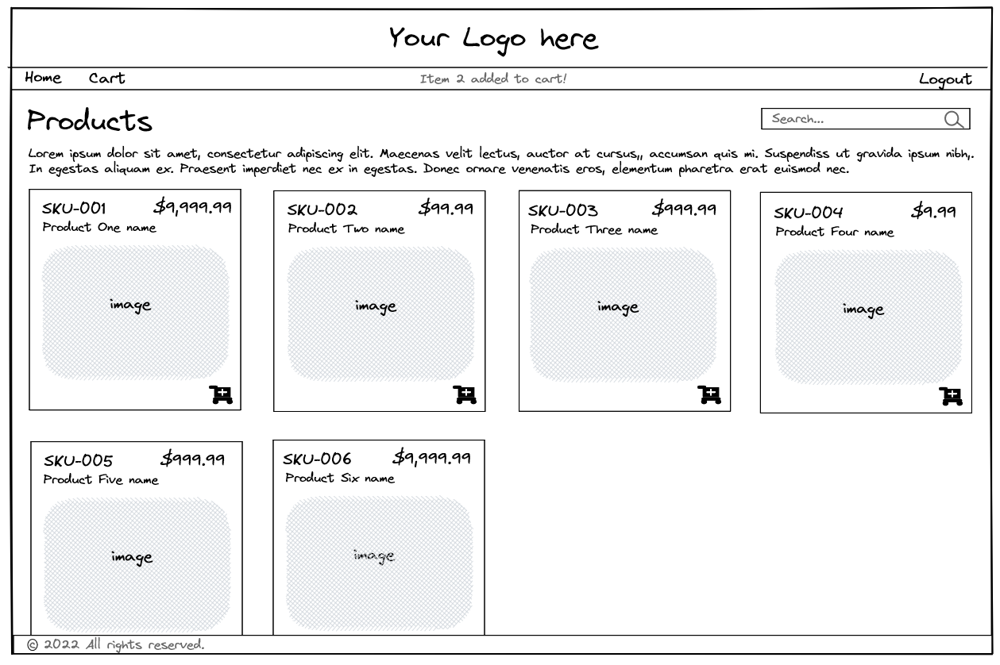
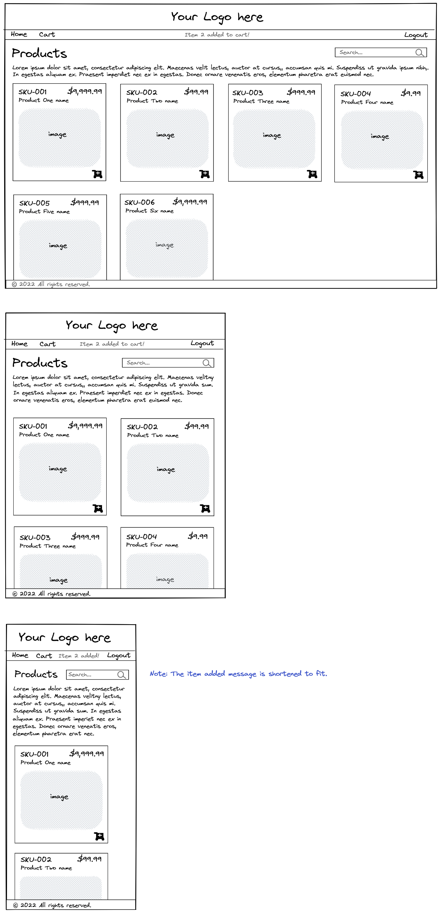

# Module Three Mid-Module Project

In the mid-module project you'll apply all the programming skills and knowledge you've acquired to this point in Module Three. In particular, you'll demonstrate the following:

* Creating HTML and use of semantic elements
* CSS styling and layout with grid and flexbox
* JavaScript arrays and loops
* DOM manipulation
* Event handling and listeners
* Using data from an event object

## Application

This application allows a retailer to sell their products to customers in an online setting. Customers can view a list of products in the application, or search for a particular item using a built-in search bar. With a click they can view more information about a product, or add the product to a personal cart.

The [Requirements](#requirements) section later in this document describes the application features in greater detail.

Here is a wireframe of the fully functioning website:




## Starting code

Open the Module Three mid-module project in VSCode and review the starting code.

The starting code provides you with an application that displays a set of products based on hard-coded data found in `index.html`. The application lacks style and interactivity.

Some key files to explore:

### `index.html`

The `<head>` element contains links to all essential stylesheets and scripts. This part of the file requires no modification.

`<section id="product-cards">` contains temporary data describing four cards. Note these hard-coded cards have different attributes than the cards you'll eventually generate.

### `script/productService.js`

`allProducts[]` holds the data for seven products that you need to display in your application. You need to read this array and dynamically generate a set of elements from this data. These elements replace the hard-coded values currently in the `index.html` file.

`getProducts()` returns the `allProducts` array.

You'll add additional methods to this file that return subsets of the `allProducts` array.

### `script/app.js`

This file has no content save a brief top comment. Use it to:

* Hook up your event handlers.

* Write all methods that define the required behavior of the application.

### `css/style.css`

Another empty file. Use `style.css` to style the application as you wish, ensuring that it matches the wireframe images provided.

## Requirements

**Requirement 1: Create header**

Add a `header` element to the top of the page.

The `header` must:

* Display a logo centered on the page
* Always display at the top of the viewport, regardless of scroll position

For the logo, you can insert a placeholder image from [Placeholder.com](https://placeholder.com/). For example, to insert a JPEG image with dimensions 700 pixels by 200 pixels, you can include the following image element:

```html

```

**Requirement 2: Create nav**

Add a `nav` element after the `header` element and before the existing `main` element.

The `nav` must:

* Have three links—"Home", "Cart", and "Logout"
* Left justify "Home" and "Cart" links
* Right justify "Logout" link
* Always display at the top of the viewport, right after the `header`

*Tip*: You can assign the `href` attribute for all links as `"#"` so that the page doesn't reload when they're clicked.

**Requirement 3: Create footer**

Add a `footer` element after the existing `main` element but still within the encompassing `<div id="app">`.

The `footer` must:

* Contain copyright text
* Always display at the bottom of the viewport, regardless of the length of the main section

*Tip*: You can copy/paste the copyright symbol from here—`©`—or put `&copy;` in your HTML to have the browser render it.

**Requirement 4: Enable main scrolling**

Style the `main` element so that it scrolls if its content doesn't fit in the available space.

**Requirement 5: Style the product card collection**

Style the product card collection. Use `flexbox` to ensure that the cards respond to varying screen width as shown in the following images:



**Requirement 6: Style the product cards**

Style the individual product cards. Use `grid` to arrange the information in the product cards like in the sample wireframes.

**Requirement 7: Build cards From data**

Remove the hard-coded cards currently in your HTML. Build cards dynamically from the data in `productService.js`.

Reference the hard-coded HTML to aid you in creating elements. Pay attention to the nesting of elements and their classes. Also take note of the `data-id` attribute on the hard-coded elements, numbered 1-4. Your dynamically generated cards must have this attribute as well, each with a unique value.

*Hint*: See [Currency formatting](#currency-formatting) in the Hints section for how to format numbers in JavaScript.

*Hint*: You might not expect to see the cart icon in an `<i>` tag, but that and classes like `fa-solid` and `fa-cart-plus` are how the open source library of icons called **Font Awesome** loads its icons. For more information see [Font Awesome icons](#font-awesome-icons) in the Hints section.

*Hint*: Use `setAttribute()` to add element attributes. See [Using `setAttribute()` and `getAttribute()`](#using-setattribute-and-getattribute) in the Hints section for more information.

**Requirement 8a: Add event handler to product name**

Set up an event handler such that clicking the product name triggers a `window.alert` displaying the product description.

*Hint*: Use `getAttribute()` to identify which product the user clicked. See [Using `setAttribute()` and `getAttribute()`](#using-setattribute-and-getattribute) in the Hints section for more information.

**Requirement 8b: Add event handler to the shopping cart icon**

Create an event handler such that when the user clicks the shopping cart icon they receive a `window.alert` notification that the item has been added to the cart.

**Requirement 9: Add a textbox for search**

Add a textbox that allows the user to enter a search term. Then in `productService.js` define a method `searchProducts(searchTerm)`. Use the array `filter` method so that `searchProducts` returns all products equal to or containing the `searchTerm` parameter.

Add the `keyup` event listener to your search bar. Use `searchProducts(searchTerm)` to filter the products list if there's a search term, and `getProducts()` if not.

**Optional**

Upgrade your event handlers from **Requirements 8a and 8b**. Instead of generating a window alert, deliver the appropriate message to a "message window" that's centered within your `nav`. The message window remains hidden when not displaying a message. Otherwise the event handlers remain the same:

* Clicking the product name causes the product description to appear in the message window.
* Clicking the shopping cart causes the message window to state that the item has been added to the cart.

---

## Hints

### Currency formatting

To show the product's price in the proper format, you can use the `Intl.NumberFormat` object. `Intl.NumberFormat` accepts `locale` and `options` as arguments. `locale` specifies the region whose formatting rules you want to use. `options` allows you to specify what type of formatting you want to apply to your number.

For example, to display a value in U.S. Dollars (USD):

```javascript
Intl.NumberFormat(`en-US`, {
        currency: `USD`,
        style: "currency",
    }).format(value);
```

For a more extensive description of the capabilities of `Intl.NumberFormat`, check out [Mozilla's documentation](https://developer.mozilla.org/en-US/docs/Web/JavaScript/Reference/Global_Objects/Intl/NumberFormat)

### Font Awesome icons

**Font Awesome** is an open source provider of icons, many of which you can use for free.

If you want to use icons from the Font Awesome library, start by adding their kit to your project. This is already done for you in the header of `index.html`:

```html
<link rel="stylesheet" href="https://cdnjs.cloudflare.com/ajax/libs/font-awesome/6.1.2/css/all.min.css" />
```

With the kit installed, you can choose from [thousands of free icons to add to your site](https://fontawesome.com/search?m=free&o=r). Click on an icon in the search page to reveal different options for icons and the HTML that you need to display it on your page.

For example, to display an icon of a heart:


You just need to add the following tag to your HTML:

```html
<i class="fa-regular fa-heart"></i>
```

Font Awesome offers many other icons, including the magnifying glass and shopping cart that you see in the wireframe solution.

### Using `setAttribute()` and `getAttribute()`

HTML elements can provide more information in the form of **attributes**. For example, the hard-coded product data gives each `product-name` a `data-id` attribute. Each `data-id` has a unique numeric value:

```html
<div class="product-name action" data-id="1">A super product</div>
```

To set an attribute, you use the `setAttribute()` method on the element you're adding the attribute to. It takes two parameters—the name of the attribute you're setting, and the value.

Since each value is unique, you can use the `productId` to set each `data-id`:

```javascript
div.setAttribute("data-id", product.productId);
```

You can retrieve an attribute with `getAttribute()`. This methods takes one parameter—the attribute name.

You can get the `data-id` to identify which `product-name` the user clicked using the `getAttribute()` method:

```javascript
// Get the id of the target
const id = Number(ev.currentTarget.getAttribute("data-id"));
```
